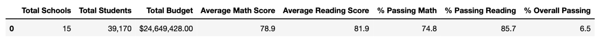
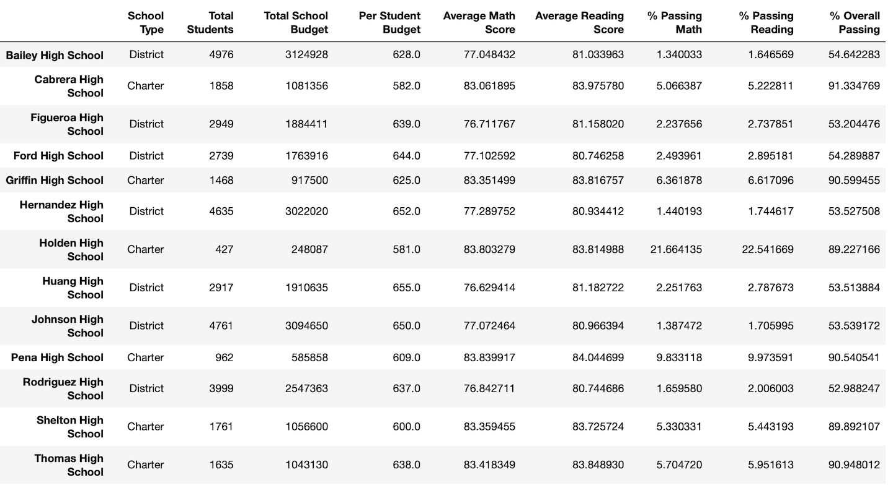
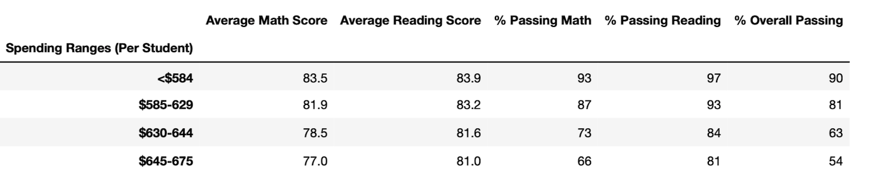
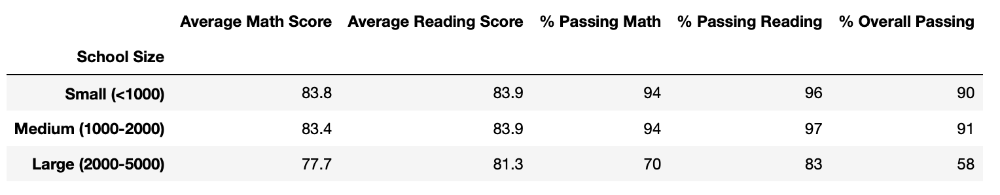
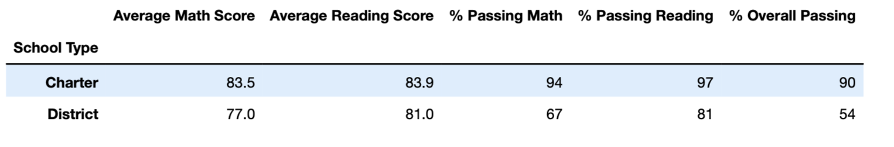

# School_District_Analysis
Jupiter Notebook, Python 3.9, VSC
## Overview 
Performing analysis on district schools standardized test scores and demonstrate insights about performance, trends and patterns in relation with school budget, school size and school type. 
This analysis will assist school boards and superintendents help making informed and strategical decisions at district level regarding budget and future decisions. 
The school board discovered an issue with Thomas High School 9th grader’s test scores. Therefore, the decision not to include the data in the research was made. However, instead of removing the data it was best to replace math and reading scores for Thomas High School with NaNs while keeping the rest of the data intact.

Let’s explore some analysis. 

- **District Summary:** There was almost no difference on the district summary.

 

- **School summary:** We can see slight drop on passing math, reading and overall passing percentage. 

 

-**Math and reading scores by grade:** Only difference is that under 9th graders who attend Thomas High Shows NaN. 

-**Scores by school spending:** The numbers stay nearly identical. 

-**Scores by school size:** When reviewing the School Size summary, removing the ninth-grade scores did not affect the average math and reading scores, but it did affect the passing percentages for medium-sized schools (1,000-2,000).

-Scores by school type: Did not affect the average scores for these two school types.

By observing our analysis, it is certain that the change we made on Thomas High School 9th graders (total of 461 students) affected our analysis in certain ways, but not vastly overall.

